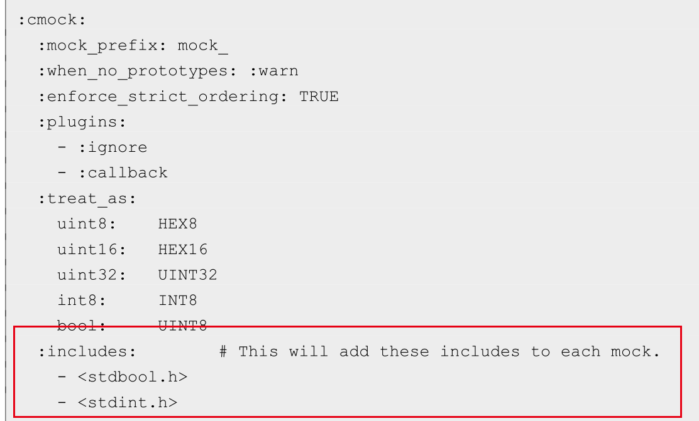

# Creating a New Ceedling Project

## 环境准备
ruby:
sudo apt-get install ruby

ceedling:
gem install ceedling

如果下载不了，需要更换国内的源:
gem sources

gem sources --remove https://rubygems.org/

添加国内源:
gem sources -a https://gems.ruby-china.com/
或者
gem sources --add https://mirrors.tuna.tsinghua.edu.cn/rubygems/

检测方法：
gem sources -l

更新源缓存：
gem sources -u

## 使用ceedling创建工程
ceedling new 工程名称
如
ceedling new blinky

## example1---如何使用ceedling进行TDD测试驱动开发
### create a module
ceedling module:create[lights]

可以通过
ceedling module:create[electrical/leds]
创建更深层次的目录结构

此时，可以通过
ceedling
命令，进行测试并查看测试情况

### 实现一个特性
lights.h 头文件，增加API接口定义
lights.c 增加API的接口实现

在test_lights.c里，增加对新增的API接口的测试用例

test_WhenTheHeadlightSwitchIsOff_ThenTheHeadLightsAreOff

### Mocking 硬件接口
如何测试嵌入式软件？如何解决对硬件的依赖呢？

这时候需要用到mocking技术，即仿冒或模拟

通过仿冒硬件接口，可以不需要实际的硬件来进行单元测试

通过Mocking技术，可以将依赖硬件的层序解耦成下面的形式：

## example2---如何使用mock技术解耦硬件依赖
本例子的硬件结构如下：

1.创建温度传感器模块
ceedling module:create[tempSensor]

假设温度传感器寄存器值和实际温度的对应关系如下：

则写出test_whenTempRegisterReadsMaxValue_thenTheTempIsTheMaxValue测试用例代码：

2.mock I2C API接口
在test_tempSensor.c里，添加
#include "mock_i2c.h"
告诉ceedling，你需要ceeding 对i2c.h进行mock，ceedling会生成
mock_i2c.c和mock_i2c.h并编译到target，在我们的test_tempSensor.c里，就可以调用这些mock的接口了

3.执行测试
ceedling

## example3---如何对已有的项目使用Ceedling进行单元测试

通常情况下，你发布bin并测试的方法如下：

TDD测试开发时，使用ceedling增加单元测试代码并单独发布，不影响现有的发布代码

### 以已有的一个项目为例
git clone https://github.com/ElectronVector/add-ceedling-to-existing-project.git

mv add-ceedling* blinky
ceedling new blinky

通过以下命令，查看ceedling管理了哪些源文件
ceedling files:source

1.创建一个新的测试文件

ceedling module:create[led]

2.添加更多的源文件目录路径
某些源文件是由第三方提供的，可以通过配置project.yml文件，设置搜索路径：

3.添加需要mock的头文件到test_led.c里

#include "mock_gpio.h"

通过这种方式告诉ceedling，你直到有一个gpio.h文件，需要ceedling去mock并生成
mock_gpio.c和mock_gpio.h

4. 添加其它的头文件到ceedling搜索路径

默认对于extern的API接口，是不是mocking的，如果需要对extern的API也生成mock，需要在project.yml里添加配置：

:cmock:

  :treat_externs: :include

5.测试

ceedling test:all

### gcov代码覆盖率
参考：
https://github.com/ThrowTheSwitch/Ceedling/blob/master/plugins/gcov/README.md
https://blog.csdn.net/qq_42069216/article/details/118667607

1.激活gcov

2.配置gcov

3.执行测试
ceedling gcov:all utils:gcov

4.查看gcov结果
build/artifacts/gcov/目录下查看html结果

## post-ceedling-demo
ref:https://blog.zaleos.net/unit-testing-c-code-with-ceedling-and-cmock/
### basic example
step1_skeleton_example
用于测试基本的函数功能，主要使用Unity的接口和宏定义

### 测试中用到了外部的函数库
需要修改project.yml，将头文件路径和lib库文件路径写入到project.yml里

### 支援文件
有时候，需要用到一些用于帮助测试的文件，这些文件只用于测试，不希望被编译到最终的binary里。这种文件被称为支援文件。
可以把支援文件放到特定的目录里，并通过配置project.yml，可以在测试是编译使用，而不会对正式的代码产生影响

### 内存泄漏检测Valgrind
Valgrind用于检测C代码中有无内存泄漏，可以跟Ceedling接口，测试代码是否存在内存泄漏的问题
sudo apt-get install valgrind

### CMock功能
有时候，需要模拟函数的调用，返回值等情况，会用到CMock
step5_mocking

### 深层次依赖关系问题
step6_deep_dependencies

step7_auto_deep_linking
